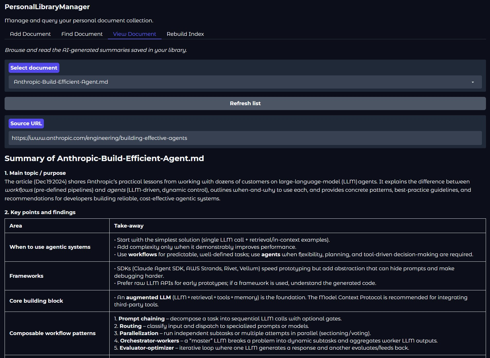

# Personal Library Manager
This is a leisure project of mine to manage documents (research papers, tech blogs, etc) that I am interested in.




## Introduction

As a former Ph.D. student, I spent an unreasonable amount of time “managing” papers, tech reports, blog posts—and by managing, I mean forgetting where I saved them and how deeply I meant to read them.

Want to revisit a paper on a specific topic? That usually required a heroic excavation of my biological memory (which, unfortunately, does not support keyword search). Meanwhile, the number of new papers has been growing at a rate best described as “mildly terrifying.”

Now that LLMs are actually useful (and not just fancy autocomplete), we finally have a real shot at fixing this problem.

So I built this project by putting myself back into my Ph.D. shoes—sleep-deprived, over-caffeinated, and constantly losing track of PDFs—with two guiding principles:

    Frugality — My wallet during my Ph.D. had strong opinions. This must be free.
    Lightweight — If it does more than it needs to, it’s already too much.

## Set up

### Pre-requisite

1. `uv` --- for managing venv and dependecies
2. Huggingface API tokens --- Create an account in `https://huggingface.co/`, put `export HF_TOKEN=<your_huggingface_token>` into `~/.bashrc` or `~/.zshrc` depending on your OS.

### Preparing venv and dependencies


**Make sure** `export HF_TOKEN=<your_huggingface_token>` is configured :)

```bash
uv sync  # Create venv, and install all dependecies
source .venv/bin/activate
uv pip install -e .              # installs all deps and registers the `plib` CLI
```

## QuickStart - GUI (web app)

The easiest way to access the personal library manager is via GUI:

```bash
plib gui
```

Then open your browser and navigate to `http://127.0.0.1:7860`.

The GUI has four tabs:

| Tab | What it does |
|-----|--------------|
| **Add Document** | Fetch a URL (HTML or PDF), generate an AI summary, save it to the library, and register it in the RAG vector index. Progress streams in real-time. |
| **Find Document** | Ask a natural-language question; returns ranked source documents and an AI-synthesized answer (requires `HF_TOKEN`). Click any filename in the results table to jump directly to View Document. The embedding model is pre-loaded at startup so searches are fast from the first query. |
| **View Document** | Browse and render any document in `doc_summary/` as formatted markdown; shows the original source URL. Dropdown defaults to empty — select a document to display it. |
| **Rebuild Index** | Re-embed all documents into the vector index (full rebuild or incremental). Output streams in real-time. |


Press **Ctrl+C** to shut down the server gracefully.

You can also play with:
```bash
plib gui --port 8080 --share  # For creating a public link, not tested though.
```

## Usage 

When you encounter a paper / blog of interest, use this tool to save:

    1. A not-too-brief summary of its content generated by LLM.
    2. Original URL of the document

to your local device in `@doc_summary/` folder --- This serves as your database (library).

Later, when you would like to recall things you have seen about a specific topic, there's a RAG system `@RAG/` for you to help you fetch the most related documents.

Then, you can use the built-in `view document` option to skim the summary of the document --- or you can follow the original URL to see the original document.

## Hint

If you fork the repo, remove `@/doc_summary` folder from .gitignore, you will be able to get a cloud sync version of all your document on all your computer devices.


## Quick start - CLI

```bash
# Add a document
plib add --url https://example.com/article --name My_Article.md
plib add --url https://arxiv.org/pdf/2303.08774        # LLM proposes filename from content

# Query
plib query --query "your question here"
plib query --query "your question here" --top-k 3
plib query --query "your question here" --retrieval-only

# Rebuild index
plib rebuild
plib rebuild --incremental
```

## Running Tests

```bash
uv run python -m pytest tests/ -q
```

## Python API

```python
from RAG import query

result = query("how should long-running agent harnesses be designed?")
print(result["answer"])
for doc in result["sources"]:
    print(doc["score"], doc["file_name"], doc["url"])
```

## Acknowledgement

This project is heavily vibed with Claude Code.

This project uses HuggingFace free inference API (please keep it free).

